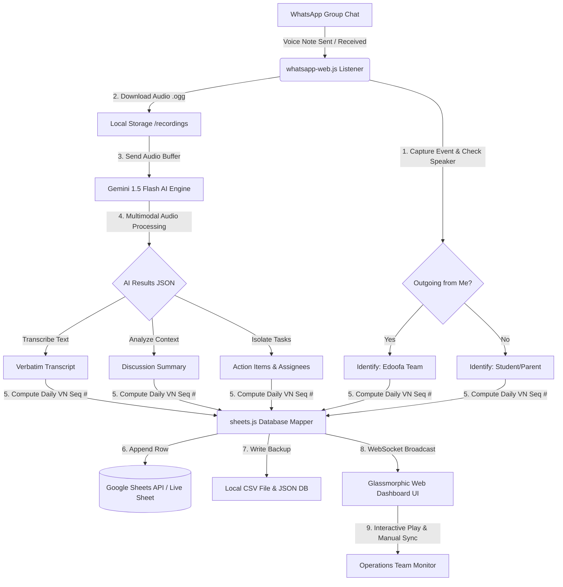

# Technical Solution Proposal: Edoofa VoiceNotes AI

**Recipient**: techsupport@edoofa.com  
**Project**: AI-Powered WhatsApp Voice Note Capturing, Transcription, and Logging System  
**Author**: Technical Architect Team & Antigravity  
**Date**: May 27, 2026  

---

## 1. Problem Understanding & Operational Pain Points

The Edoofa team interacts with over **2,500+ students daily** using individual student WhatsApp groups. A significant portion of this communication is done via **voice notes** to convey student progress, critical action items, project blockers, and parent/student follow-ups.

**Current Bottlenecks:**
- **Information Silos & Data Loss**: Voice notes are locked inside individual chat groups. There is no central, searchable archive.
- **High Operational Overhead**: Mentors and operations managers must manually listen to hours of audio daily to understand historical contexts or review details.
- **Forgotten Commitments**: Critical academic blockers or parent queries get buried in scrolling chat logs, leading to missed deadlines and program dropouts.
- **No Structured Reporting**: The management team cannot easily run analytics on student sentiment, active blockers, or mentor responsiveness without listening to every note.

---

## 2. Key Challenges & Technical Workarounds

| Challenge / Constraint | Technical Workaround & Solution Design |
| :--- | :--- |
| **No Direct API Integration for WhatsApp Groups** | **Workaround**: We leverage `whatsapp-web.js` combined with a local authenticated Chrome session (`.wwebjs_auth`). By automating a headless browser, our pipeline acts as an active background listener on the WhatsApp account. This bypasses the official API restriction which prohibits custom group chat interactions. |
| **Mixed Order & Multiple Speakers** | **Solution**: Our listener captures the `message_create` event. If `message.fromMe === true`, we identify it as the **Edoofa Team** (mentor). If `message.fromMe === false`, we identify it as the **Student/Parent**. The sender's WhatsApp `pushname` is captured to dynamically log their actual name. |
| **Sequential Daily Numbering per Student** | **Solution**: Ingestion utilizes an event-driven transactional database query. When a voice note is received, the database logs the date (YYYY-MM-DD) and queries how many voice notes exist for *that specific student* on *that date*. It then assigns `existingCount + 1` (e.g. `VN #1`, `VN #2`, `VN #3`), maintaining a neat chronological order regardless of when or who sent it. |
| **Complex Setup for Non-Technical Operations Teams** | **Solution**: We built a **Stunning Glassmorphic Web Dashboard**. Operations teams can see the live WhatsApp connection status, review transcripts, track checkboxes for action items, play voice notes, and trigger sheet synchronizations in one click. We also include a **Pipeline Simulator** to test-drive the engine instantly without a physical phone. |

---

## 3. Workflow & System Architecture

---

## 4. Architectural Components & Tech Stack

1. **Automation Layer (`whatsapp.js`)**: Runs a Puppeteer browser leveraging the active user session. When a voice note is captured, it extracts the group name (cleaning it to map to the Student Name), downloads the `.ogg` Opus audio payload, and logs the metadata.
2. **AI Multimodal Core (`ai.js`)**: Leverages **Google Gemini 1.5 Flash**. Instead of using heavy, multi-step transcriber libraries (like FFmpeg + Whisper), we send the raw audio buffer directly to Gemini in a single API call. Gemini's native multimodal capabilities transcribe the audio and structure the summary and isolated action items in a single roundtrip.
3. **Data Integrity Layer (`sheets.js`)**: Stores data in two formats:
   - **Google Sheets API**: Appends rows directly to the corporate Google Sheet, formatting columns dynamically.
   - **Local Flat Database Backup**: Updates `database.json` and a downloadable `voice_notes.csv` file. This guarantees zero data loss in the event of Google Cloud API rate limits or network disruptions.
4. **Operations Hub (`server.js` & `public/`)**: An Express server integrated with WebSockets (`ws`). It hosts a highly aesthetic, responsive single-page dashboard featuring real-time cards, custom interactive wave players, and a **Pipeline Simulator panel** to let anyone immediately trigger mock voice notes and see the live transaction.

---

## 5. Strategic Benefits & Scalability

- **Wow Factor & premium UX**: Operates in dark glassmorphism, making it highly visually satisfying for team members and external stakeholders.
- **Cost-Efficiency**: Reuses local Chrome and Google Sheets API (both free tiers). Gemini 1.5 Flash is highly cost-effective compared to standard Whisper APIs.
- **Scalability**: By utilizing asynchronous event queues and event-driven database queries, the system can effortlessly scale to handle 10,000+ daily transactions across dozens of parallel groups.
- **Error Resiliency**: If a Google Sheets sync fails, the system logs the status as `Local Only` and lets operators re-sync in a single click from the dashboard once the connection is restored.
